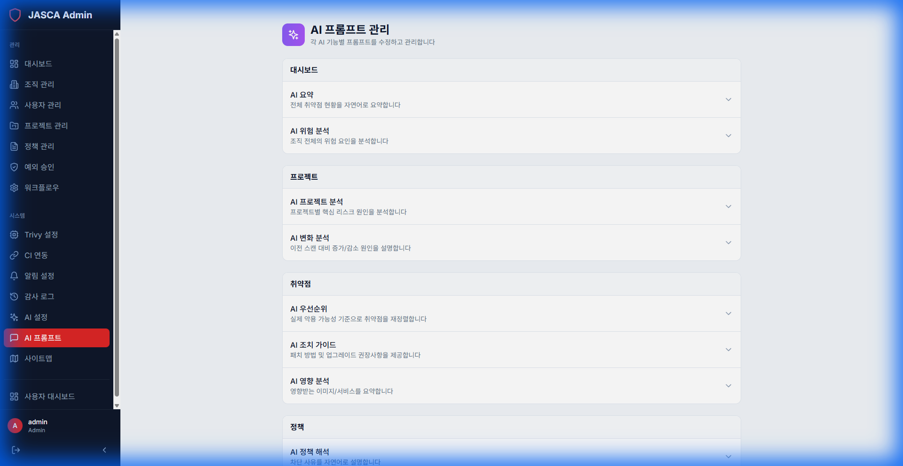

# AI 프롬프트 (AI Prompts)

## 개요

취약점 분석 및 수정 제안과 같은 다양한 작업에 대해 AI 모델이 사용하는 시스템 프롬프트를 관리하고 사용자 정의합니다.

## 주요 기능

- **프롬프트 라이브러리**: 모든 활성 시스템 프롬프트 목록입니다.
- **프롬프트 편집**: AI에 제공되는 특정 지침을 사용자 정의합니다.
- **테스트**: 샘플 입력에 대해 프롬프트를 테스트합니다.

## 스크린샷

