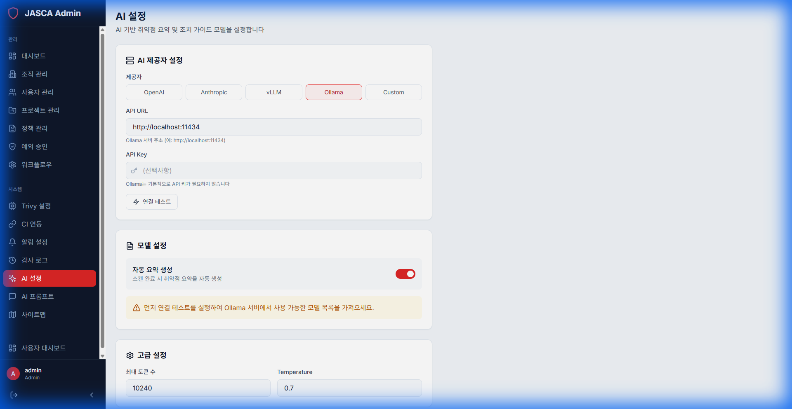

# AI Settings

## Overview

Configure the artificial intelligence capabilities of the platform, including model selection and provider management.

## Key Features

- **Model Selection**: Choose the AI model to use for analysis (e.g., GPT-4, Claude).
- **Provider Configuration**: Manage API keys and endpoints for AI providers.
- **Parameters**: Adjust temperature, tokens, and other model parameters.

## Screenshots

