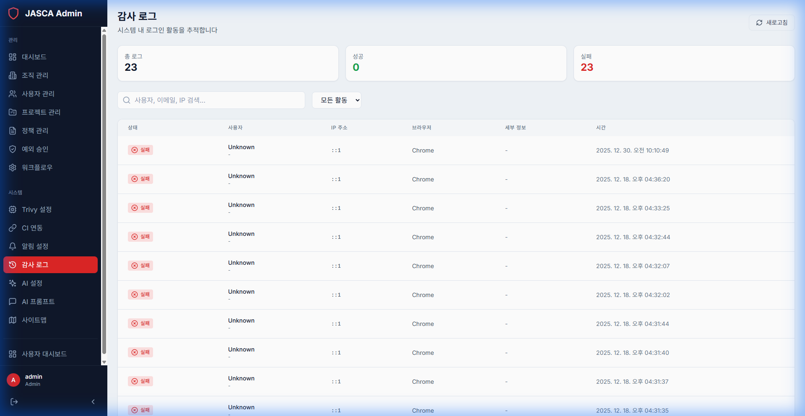

# Audit Logs

## Overview

View a comprehensive history of actions taken within the system. This includes login attempts, policy changes, and configuration updates.

## Key Features

- **Log Viewer**: Filterable list of all system activities.
- **Search**: Find specific actions by user, IP, or event type.
- **Export**: Download logs for compliance and reviewing.

## Screenshots

