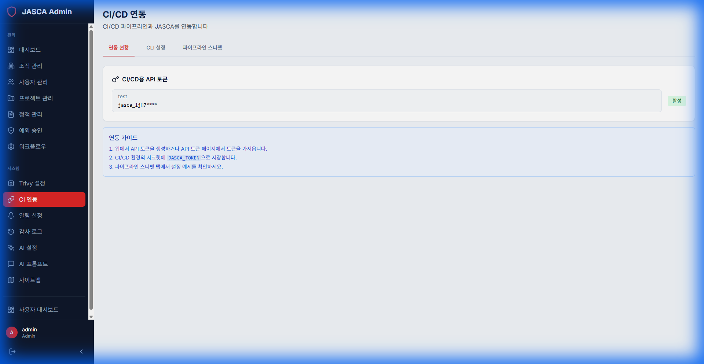

# CI 연동 (CI Integration)

## 개요

Jenkins, GitHub Actions, GitLab CI와 같은 지속적 통합(CI) 시스템과의 통합을 관리합니다. 파이프라인에서 자동 스캔을 위한 웹훅 및 토큰을 생성합니다.

## 주요 기능

- **연동 상태**: 연결된 CI 시스템을 확인합니다.
- **웹훅 관리**: 스캔 트리거 수신을 위한 특정 웹훅을 관리합니다.
- **토큰 생성**: CI/CD 파이프라인 인증을 위한 토큰을 생성합니다.

## 스크린샷

