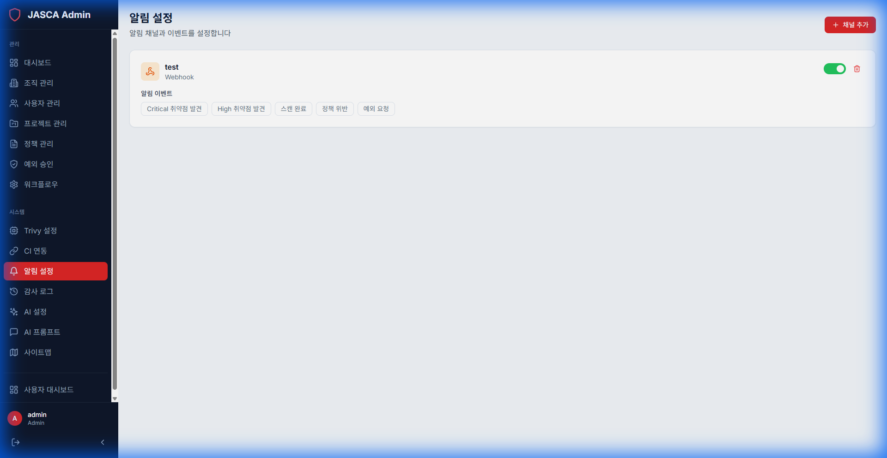

# 알림 설정 (Notification Settings)

## 개요

경고, 업데이트 및 보고서에 대한 시스템 전체 알림을 구성합니다. 이메일, Slack 또는 웹훅과 같은 채널을 관리합니다.

## 주요 기능

- **채널 구성**: 이메일 서버 또는 Slack 웹훅을 설정합니다.
- **이벤트 트리거**: 알림을 트리거할 이벤트를 선택합니다 (예: 치명적인 취약점 발견).
- **수신자 관리**: 특정 경고를 받을 대상을 정의합니다.

## 스크린샷

