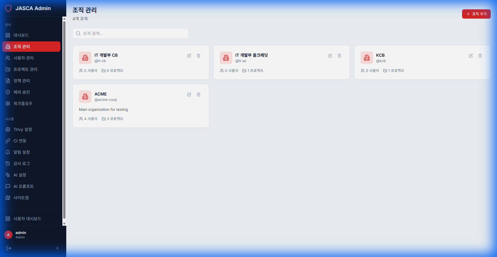
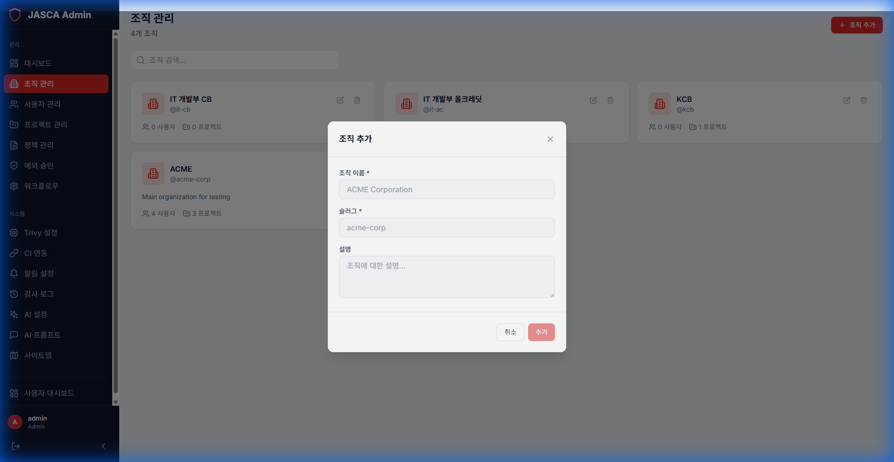

# Organization Management

## Overview

The Organization Management section allows administrators to manage the organizational structure within Jainsight. This includes creating new organizations, updating details, and managing related settings.

## Key Features

- **List Organizations**: View a paginated list of all organizations.
- **Create Organization**: Add new organizations to the system.
- **Edit Details**: Update organization names, descriptions, and other metadata.
- **Delete Organization**: Remove internal organizations if necessary.

## Screenshots

### List View

### Create Organization

