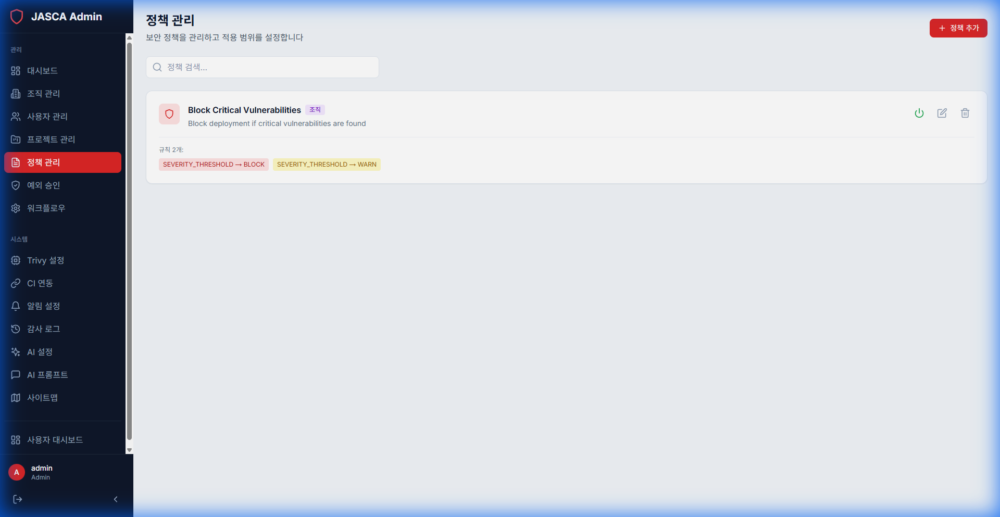

# 정책 관리 (Policy Management)

## 개요

정책 관리는 조직 전체에 보안 표준을 정의하고 시행하는 데 중요합니다. 관리자는 취약점 처리 및 차단 방식을 지시하는 정책을 생성할 수 있습니다.

## 주요 기능

- **정책 목록**: 활성 및 비활성 보안 정책을 확인합니다.
- **정책 생성**: 심각도, CWE 또는 기타 기준에 따라 새 규칙을 정의합니다.
- **시행**: 특정 프로젝트 또는 전체 조직에 정책을 적용합니다.

## 스크린샷

