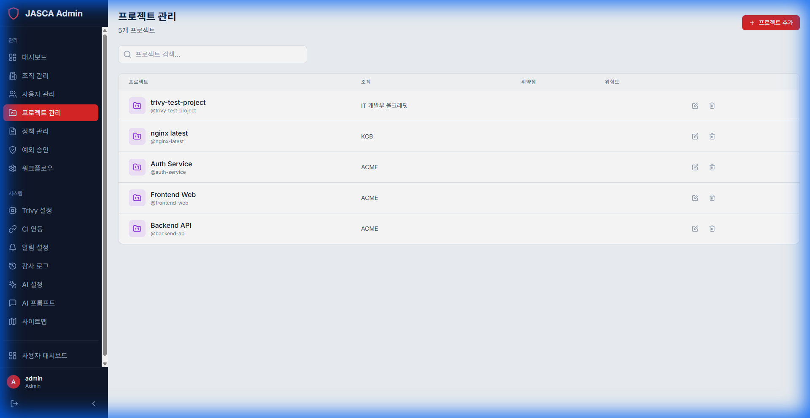

# 프로젝트 관리 (Project Management)

## 개요

프로젝트 관리를 통해 관리자는 조직 내의 모든 프로젝트를 감독할 수 있습니다. 프로젝트 세부 정보를 확인하고, 할당을 관리하며, 프로젝트 상태를 추적할 수 있습니다.

## 주요 기능

- **프로젝트 목록**: 모든 프로젝트에 대한 포괄적인 뷰입니다.
- **프로젝트 세부 정보**: 특정 구성 및 스캔 기록에 액세스합니다.
- **관리**: 사용자를 프로젝트에 할당하고 프로젝트별 설정을 구성합니다.

## 스크린샷

