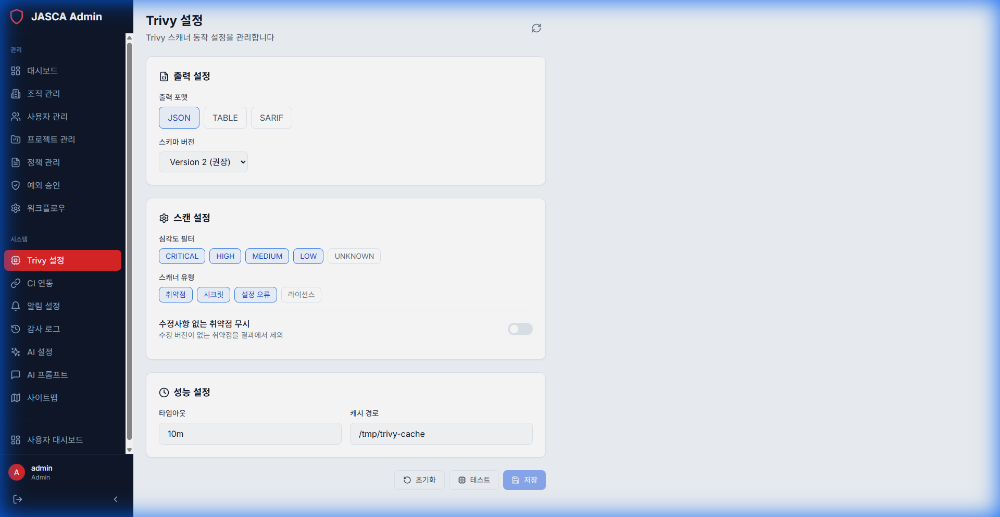

# Trivy 설정 (Trivy Settings)

## 개요

보안 스캐너인 Trivy와의 통합을 구성합니다. 서버 엔드포인트, 인증 토큰 및 스캔 기본 설정을 관리합니다.

## 주요 기능

- **서버 구성**: Trivy 서버 URL 및 포트를 설정합니다.
- **인증**: 보안 연결을 위한 API 토큰을 관리합니다.
- **스캔 옵션**: 기본 스캔 매개변수를 구성합니다.

## 스크린샷

