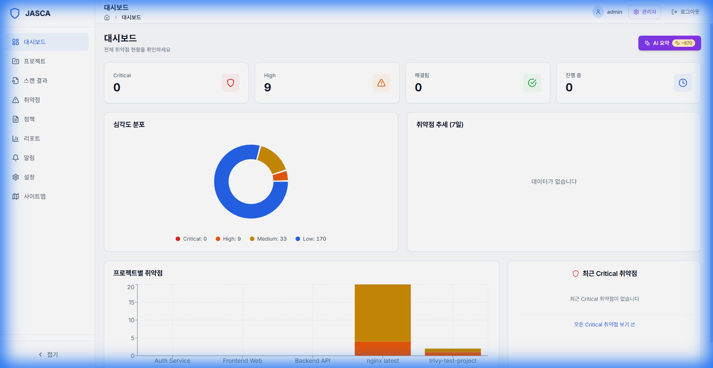
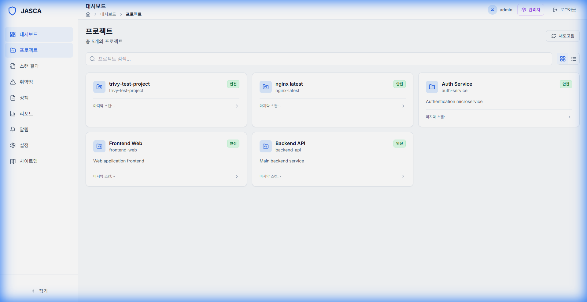
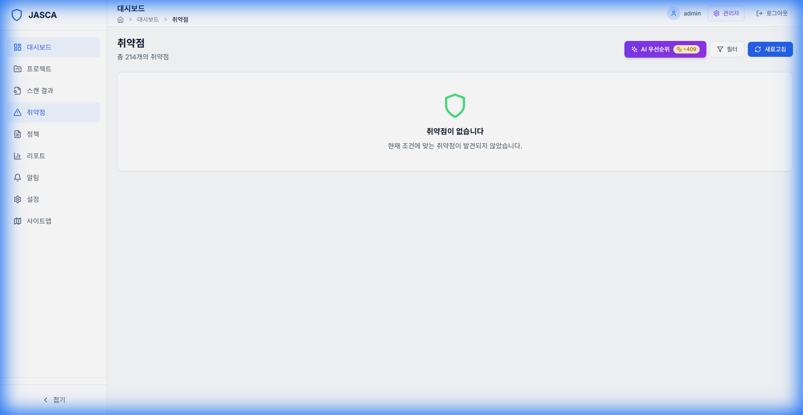
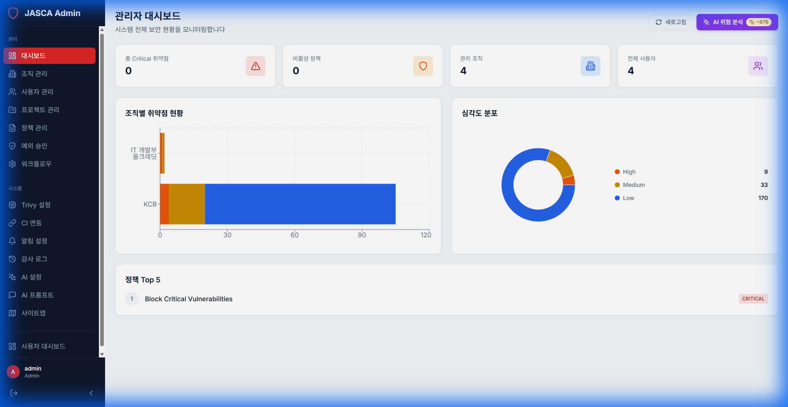

# Jainsight 사용자 매뉴얼

## 소개

Jainsight는 조직의 애플리케이션 보안을 관리하고 모니터링하기 위한 통합 플랫폼입니다. 본 매뉴얼은 일반 사용자 및 관리자가 시스템을 효과적으로 활용할 수 있도록 안내합니다.

---

## 목차

1. [일반 사용자 가이드](#1-일반-사용자-가이드)
   - [대시보드](#대시보드-dashboard)
   - [프로젝트 관리](#프로젝트-관리-projects)
   - [스캔 결과 및 취약점](#스캔-결과-및-취약점)
   - [보고서 및 알림](#보고서-및-알림)
2. [관리자 가이드](#2-관리자-가이드)
   - [관리자 대시보드](#관리자-대시보드-admin-dashboard)
   - [조직 및 사용자 관리](#조직-및-사용자-관리)
   - [정책 및 예외 관리](#정책-및-예외-관리)
   - [시스템 설정](#시스템-설정)

---

## 1. 일반 사용자 가이드

### 대시보드 (Dashboard)

로그인 후 처음 접하는 화면으로, 내 프로젝트의 보안 현황을 한눈에 볼 수 있습니다.

### 프로젝트 관리 (Projects)

할당된 프로젝트 목록과 각 프로젝트의 최신 스캔 점수를 확인합니다.

### 스캔 결과 및 취약점

발견된 보안 취약점을 상세히 분석하고 수정 방법을 확인합니다.

---

## 2. 관리자 가이드

### 관리자 대시보드 (Admin Dashboard)

전체 시스템의 상태와 통계를 모니터링합니다.

### 조직 및 사용자 관리

조직 구조를 정의하고 사용자를 추가 및 관리합니다.

### 정책 및 예외 관리

보안 정책을 수립하고 예외 요청을 처리합니다.

### 시스템 설정

Trivy 스캐너, CI 연동, 알림 등을 설정합니다.

