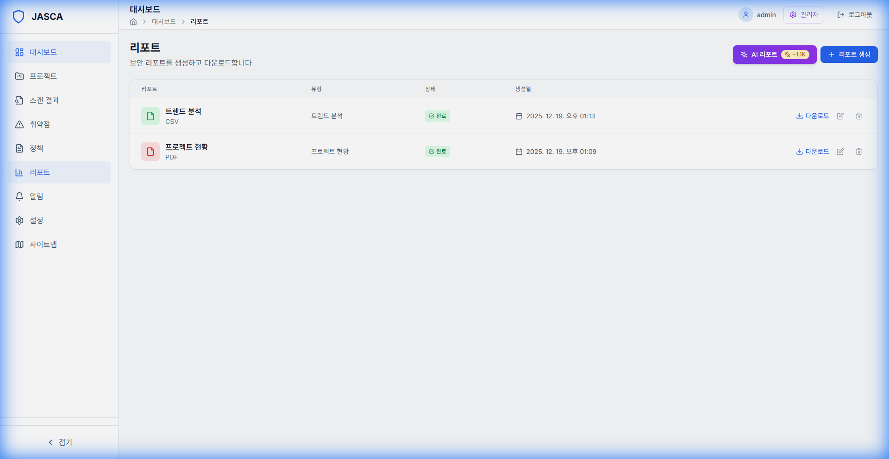

# 리포트 (Reports)

## 개요

프로젝트에 대한 보안 보고서를 생성하고 다운로드합니다. 보고서는 이해 관계자와 공유하기에 적합한 형식의 요약을 제공합니다.

## 주요 기능

- **보고서 생성**: PDF 또는 CSV 보고서를 생성합니다.
- **사용자 정의**: 포함할 데이터 포인트를 선택합니다.
- **기록**: 이전에 생성된 보고서에 액세스합니다.

## 스크린샷

